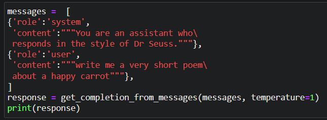
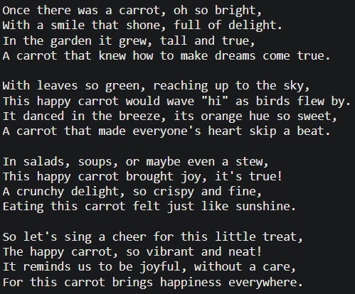
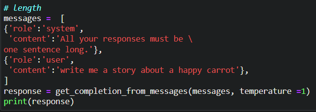
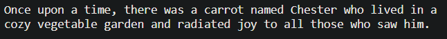
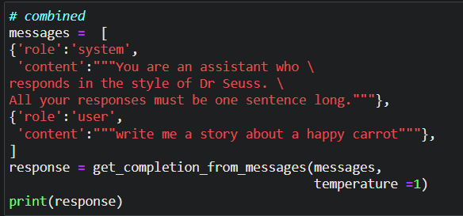
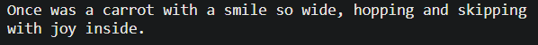

# Tokens and chat format of LLM'S

For knowing more about the kind of LLM's and various roles in OpenAI API, refer this: https://github.com/Praddyumn16/ChatGPT-Prompt-Engineering/blob/main/1.%20Introduction.md

Below is the helper code to get started with OpenAI API:

```python
import os
import openai
import tiktoken
from dotenv import load_dotenv, find_dotenv
_ = load_dotenv(find_dotenv()) # read local .env file

openai.api_key  = os.environ['OPENAI_API_KEY']

def get_completion(prompt, model="gpt-3.5-turbo"):
    messages = [{"role": "user", "content": prompt}]
    response = openai.ChatCompletion.create(
        model=model,
        messages=messages,
        temperature=0 # defines the randomness of the output where 1 = most random, 0 = most consistent.
    )
    return response.choices[0].message["content"]

response = get_completion("What is the capital of France?")
print(response) # prints: "The capital of France is Paris."
```

---

## Tokenization:

Now, if you take the word "lollipop" and ask ChatGPT to reverse it, this is what you see:

```python
response = get_completion("Take the letters in lollipop and reverse them")
print(response)
# output: The reversed letters of "lollipop" are "pillipol".
```

But, "lollipop" in reverse should be "popillol".

This is because, LLM's do not necessarily predict the next **Word**, instead they predict the next **Token.**
Where, a **Token** is just a commonly occuring sequence of characters.

So if I give a sentence like: **"Learning new things is fun!"** to ChatGPT then it will consider every word/a word with a space/an exclamation mark as a single token. Since each of them are fairly common occuring terms.

But if we give a sentence like: **"Prompting is a powerful tool."** then the word "Prompting" isn't much popular yet and hence it might tokenize into 3 tokens like: Prom, pt and ing.

One way to fix this is to give a space or dash in between the characters like:

```python
response = get_completion("Take the letters in l-o-l-l-i-p-o-p and reverse them")
```

This is because, now ChatGPT tokenizes each character (including the dash symbol) into an individual token and hence makes the reversal much easier.

Different models have different limits on the number of tokens that they can accept in the ('context' + 'completion') of the API call where the input is called 'context' and the output is called 'completion'.

---

## Setting Tone & Putting Constraints:

You can pass multiple messages into the API call instead of just passing 1 prompt like:

```python
def get_completion_from_messages(messages,
                                 model="gpt-3.5-turbo",
                                 temperature=0,
                                 max_tokens=500):
    response = openai.ChatCompletion.create(
        model=model,
        messages=messages,
        temperature=temperature, # this is the degree of randomness of the model's output
        max_tokens=max_tokens, # the maximum number of tokens the model can ouptut
    )
    return response.choices[0].message["content"]
```

and play around with setting the tone/putting the constraint on the output length/doing both as shown below:

|             Prompt              |             Output              |
| :-----------------------------: | :-----------------------------: |
|    |  |
|  |  |
|  |  |
