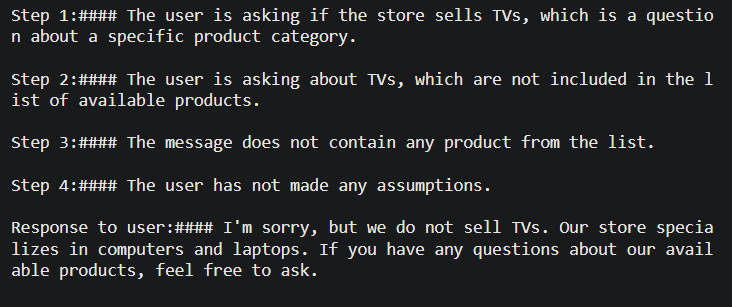

# Classification and Chaining Prompts

## Classification:

For tasks in which a lot of independent sets of instructions are needed to handle different cases, classifying the query first can be beneficial and then we can decide which instruction to use on it.

Let's try to build a customer service query agent with the following system message:

```python
delimiter = "####"
system_message = f"""
You will be provided with customer service queries.
The customer service query will be delimited with {delimiter} characters.
Classify each query into a primary category and a secondary category.
Provide your output in json format with the keys: primary and secondary.

Primary categories: Billing, Technical Support, Account Management, or General Inquiry.

Billing secondary categories:
Unsubscribe or upgrade
Add a payment method
Explanation for charge
Dispute a charge

Technical Support secondary categories:
General troubleshooting
Device compatibility
Software updates

Account Management secondary categories:
Password reset
Update personal information
Close account
Account security

General Inquiry secondary categories:
Product information
Pricing
Feedback
Speak to a human

"""
```

Now, based on the user message, we'll have the following classified outputs:

|           User Query            |   Output in specified format    |
| :-----------------------------: | :-----------------------------: |
|  |  |
|  |  |

---

## Chain of Thought reasoning:

Sometimes a model might lead to an incorrect conclusion based on some reasoning error. So, we can actually reframe the question to request a series of reasoning steps before the model provides a final answer so that it can think longer and methodically about a problem.

```python
delimiter = "####"
system_message = f"""
Follow these steps to answer the customer queries.
The customer query will be delimited with four hashtags,\
i.e. {delimiter}.

Step 1:{delimiter} First decide whether the user is \
asking a question about a specific product or products. \
Product cateogry doesn't count.

Step 2:{delimiter} If the user is asking about \
specific products, identify whether \
the products are in the following list.
All available products:
1. Product: TechPro Ultrabook
   Category: Computers and Laptops
   Brand: TechPro
   Model Number: TP-UB100
   Warranty: 1 year
   Rating: 4.5
   Features: 13.3-inch display, 8GB RAM, 256GB SSD, Intel Core i5 processor
   Description: A sleek and lightweight ultrabook for everyday use.
   Price: $799.99

2. Product: BlueWave Gaming Laptop
   Category: Computers and Laptops
   Brand: BlueWave
   Model Number: BW-GL200
   Warranty: 2 years
   Rating: 4.7
   Features: 15.6-inch display, 16GB RAM, 512GB SSD, NVIDIA GeForce RTX 3060
   Description: A high-performance gaming laptop for an immersive experience.
   Price: $1199.99

3. Product: PowerLite Convertible
   Category: Computers and Laptops
   Brand: PowerLite
   Model Number: PL-CV300
   Warranty: 1 year
   Rating: 4.3
   Features: 14-inch touchscreen, 8GB RAM, 256GB SSD, 360-degree hinge
   Description: A versatile convertible laptop with a responsive touchscreen.
   Price: $699.99

4. Product: TechPro Desktop
   Category: Computers and Laptops
   Brand: TechPro
   Model Number: TP-DT500
   Warranty: 1 year
   Rating: 4.4
   Features: Intel Core i7 processor, 16GB RAM, 1TB HDD, NVIDIA GeForce GTX 1660
   Description: A powerful desktop computer for work and play.
   Price: $999.99

5. Product: BlueWave Chromebook
   Category: Computers and Laptops
   Brand: BlueWave
   Model Number: BW-CB100
   Warranty: 1 year
   Rating: 4.1
   Features: 11.6-inch display, 4GB RAM, 32GB eMMC, Chrome OS
   Description: A compact and affordable Chromebook for everyday tasks.
   Price: $249.99

Step 3:{delimiter} If the message contains products \
in the list above, list any assumptions that the \
user is making in their \
message e.g. that Laptop X is bigger than \
Laptop Y, or that Laptop Z has a 2 year warranty.
If not, then mention that the message does not contain
any product from the list.

Step 4:{delimiter}: If the user made any assumptions, \
figure out whether the assumption is true based on your \
product information. Else, mention that the user has not made
any assumptions

Step 5:{delimiter}: First, politely correct the \
customer's incorrect assumptions if applicable. \
Only mention or reference products in the list of \
5 available products, as these are the only 5 \
products that the store sells. \
Answer the customer in a friendly tone.

Use the following format:
Step 1:{delimiter} <step 1 reasoning>
Step 2:{delimiter} <step 2 reasoning>
Step 3:{delimiter} <step 3 reasoning>
Step 4:{delimiter} <step 4 reasoning>
Response to user:{delimiter} <response to customer>

Make sure to include {delimiter} to separate every step.
"""
```

|              Prompt              |              Output              |
| :------------------------------: | :------------------------------: |
|  |  |
|  |  |

**- Inner Monologue:** It is a tactic where we do not want the model to reveal the actual reasoning behind any response. For example, in a tutoring application, we might want to encourage the students to come up with their own answers.

Since we asked the LLM to separate its reasoning steps by a delimiter, we can hide the chain-of-thought reasoning from the final output that the user sees in the following way:

```python
try:
    final_response = response.split(delimiter)[-1].strip()
except Exception as e:
    final_response = "Sorry, I'm having trouble right now, please try asking another question."

print(final_response)
'''
OUTPUT:
I'm sorry, but we do not sell TVs. Our store specializes in computers and laptops.
If you have any questions about our available products, feel free to ask.
'''
```
